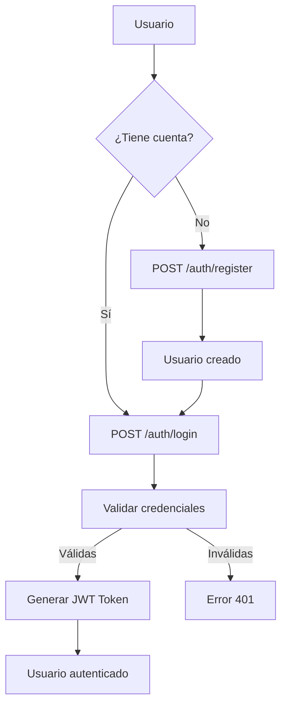
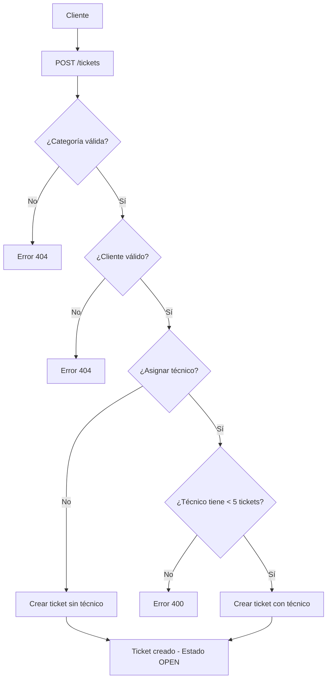
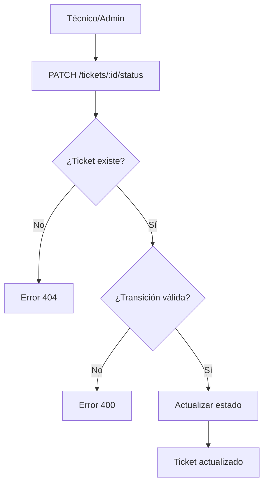
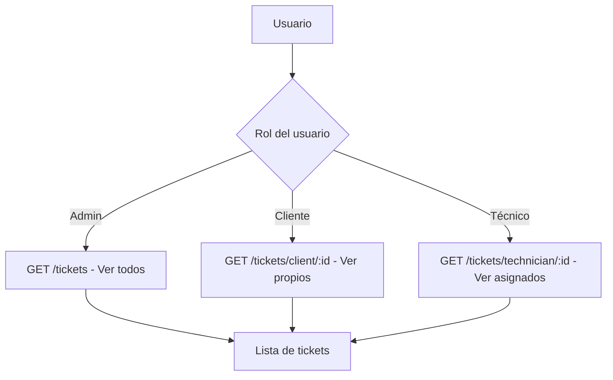

# JUSTIFICACIÓN TÉCNICA - TechHelpDesk API

**Desarrollador:** Kaled Mesa  
**Clan:** Linus  
**Fecha:** Diciembre 2024

---

## 📖 Tabla de Contenidos

1. [Introducción](#introducción)
2. [Flujo del Sistema](#flujo-del-sistema)
3. [Ciclo de Vida de la Aplicación](#ciclo-de-vida-de-la-aplicación)
4. [Requisitos Técnicos](#requisitos-técnicos)
5. [Criterios de Aceptación](#criterios-de-aceptación)
6. [Guía de Pruebas con Swagger](#guía-de-pruebas-con-swagger)
7. [Docker](#docker)
8. [Arquitectura y Diseño](#arquitectura-y-diseño)

---

## Introducción

TechHelpDesk es un sistema completo de gestión de tickets de soporte técnico desarrollado con **NestJS**, **TypeORM**, **PostgreSQL** y **JWT**. El sistema permite a diferentes tipos de usuarios (Administradores, Técnicos y Clientes) gestionar el ciclo completo de vida de tickets de soporte.

### Problema que Resuelve

Antes de TechHelpDesk, la empresa gestionaba los tickets manualmente mediante hojas de cálculo, lo que generaba:
- ❌ Retrasos en la atención
- ❌ Pérdida de trazabilidad
- ❌ Duplicidad de reportes
- ❌ Falta de control de estados
- ❌ Dificultad para asignar técnicos

### Solución Implementada

✅ Sistema centralizado con base de datos relacional  
✅ Control de acceso basado en roles  
✅ Trazabilidad completa de tickets  
✅ Validaciones de negocio automatizadas  
✅ API REST documentada con Swagger  
✅ Asignación inteligente de técnicos  

---

## Flujo del Sistema

### 1. Flujo de Autenticación



**Descripción:**
1. El usuario se registra o inicia sesión
2. El sistema valida las credenciales contra la base de datos
3. Si son válidas, se genera un token JWT con el rol del usuario
4. El token se usa en todas las peticiones subsecuentes

### 2. Flujo de Creación de Ticket



**Descripción:**
1. El cliente envía los datos del ticket
2. Se valida que la categoría exista
3. Se valida que el cliente exista
4. Si se asigna técnico, se verifica que no tenga más de 5 tickets en progreso
5. Se crea el ticket con estado OPEN

### 3. Flujo de Actualización de Estado



**Secuencia de Estados Válida:**
```
OPEN → IN_PROGRESS → RESOLVED → CLOSED
```

**Transiciones Inválidas:**
- ❌ OPEN → RESOLVED (saltar IN_PROGRESS)
- ❌ RESOLVED → IN_PROGRESS (retroceder)
- ❌ CLOSED → cualquier estado (cerrado es final)

### 4. Flujo de Consulta de Tickets



---

## Ciclo de Vida de la Aplicación

### 1. Inicialización

```typescript
// src/main.ts
async function bootstrap() {
  // 1. Crear aplicación NestJS
  const app = await NestFactory.create(AppModule);
  
  // 2. Configurar pipes de validación global
  app.useGlobalPipes(new ValidationPipe());
  
  // 3. Configurar Swagger
  SwaggerModule.setup('api', app, document);
  
  // 4. Iniciar servidor
  await app.listen(3000);
}
```

### 2. Request Lifecycle

```
1. Request HTTP → 2. Guards → 3. Interceptors (before) → 4. Pipes → 
5. Controller → 6. Service → 7. Repository → 8. Database → 
9. Response → 10. Interceptors (after) → 11. Client
```

**Ejemplo con un ticket:**

```
POST /tickets
↓
1. JwtAuthGuard verifica token
2. RolesGuard verifica rol (CLIENT o ADMIN)
3. ValidationPipe valida CreateTicketDto
4. TicketsController.create()
5. TicketsService.create()
   - Valida categoría
   - Valida cliente
   - Valida disponibilidad de técnico
6. Repository.save()
7. PostgreSQL guarda el registro
8. Retorna ticket creado
9. TransformInterceptor formatea respuesta
   { success: true, data: ticket, message: "..." }
10. Cliente recibe respuesta
```

### 3. Gestión de Errores

```typescript
// Flujo de excepciones
try {
  // Lógica de negocio
} catch (error) {
  // HttpExceptionFilter captura la excepción
  // Formatea en: { success: false, data: null, message: "..." }
}
```

---

## Requisitos Técnicos

### 1. Sistema de Autenticación y Roles ✅

#### Implementación JWT

**Archivo:** `src/auth/strategies/jwt.strategy.ts`

```typescript
@Injectable()
export class JwtStrategy extends PassportStrategy(Strategy) {
  constructor(private configService: ConfigService) {
    super({
      jwtFromRequest: ExtractJwt.fromAuthHeaderAsBearerToken(),
      secretOrKey: configService.get<string>('JWT_SECRET'),
    });
  }

  async validate(payload: any) {
    return { id: payload.sub, email: payload.email, role: payload.role };
  }
}
```

**Cómo funciona:**
1. El cliente envía el token en el header: `Authorization: Bearer <token>`
2. JwtStrategy extrae y valida el token
3. Si es válido, extrae el payload (id, email, role)
4. El payload se adjunta a `request.user`

#### Guards Personalizados

**JwtAuthGuard** (`src/auth/guards/jwt-auth.guard.ts`):
- Verifica que el token JWT sea válido
- Se aplica a todos los endpoints protegidos

**RolesGuard** (`src/auth/guards/roles.guard.ts`):
- Verifica que el usuario tenga el rol adecuado
- Lee los roles del decorador `@Roles()`
- Compara con el rol del usuario autenticado

**Ejemplo de uso:**
```typescript
@UseGuards(JwtAuthGuard, RolesGuard)
@Roles(UserRole.ADMIN)
@Get()
findAll() {
  // Solo accesible para administradores
}
```

#### Decoradores Personalizados

**@Roles()** - Especifica roles permitidos:
```typescript
@Roles(UserRole.ADMIN, UserRole.TECHNICIAN)
```

**@CurrentUser()** - Obtiene usuario autenticado:
```typescript
create(@CurrentUser() user: any) {
  console.log(user.id, user.email, user.role);
}
```

### 2. Persistencia de Datos ✅

#### Entidades y Relaciones

**User (Usuario)**
```typescript
@Entity('users')
export class User {
  @PrimaryGeneratedColumn('uuid') id: string;
  @Column() name: string;
  @Column({ unique: true }) email: string;
  @Column() @Exclude() password: string;
  @Column({ enum: UserRole }) role: UserRole;
  @OneToMany(() => Ticket, ticket => ticket.createdBy) tickets: Ticket[];
}
```

**Category (Categoría)**
```typescript
@Entity('categories')
export class Category {
  @PrimaryGeneratedColumn('uuid') id: string;
  @Column({ unique: true }) name: string;
  @Column() description: string;
  @OneToMany(() => Ticket, ticket => ticket.category) tickets: Ticket[];
}
```

**Client (Cliente)**
```typescript
@Entity('clients')
export class Client {
  @PrimaryGeneratedColumn('uuid') id: string;
  @Column() name: string;
  @Column() company: string;
  @Column({ unique: true }) contactEmail: string;
  @OneToMany(() => Ticket, ticket => ticket.client) tickets: Ticket[];
}
```

**Technician (Técnico)**
```typescript
@Entity('technicians')
export class Technician {
  @PrimaryGeneratedColumn('uuid') id: string;
  @Column() name: string;
  @Column() specialty: string;
  @Column({ default: true }) availability: boolean;
  @OneToMany(() => Ticket, ticket => ticket.technician) tickets: Ticket[];
}
```

**Ticket (Ticket)**
```typescript
@Entity('tickets')
export class Ticket {
  @PrimaryGeneratedColumn('uuid') id: string;
  @Column() title: string;
  @Column('text') description: string;
  @Column({ enum: TicketStatus }) status: TicketStatus;
  @Column({ enum: TicketPriority }) priority: TicketPriority;
  
  @ManyToOne(() => Category, { onDelete: 'RESTRICT' })
  category: Category;
  
  @ManyToOne(() => Client, { onDelete: 'RESTRICT' })
  client: Client;
  
  @ManyToOne(() => Technician, { onDelete: 'SET NULL', nullable: true })
  technician: Technician;
  
  @ManyToOne(() => User, { onDelete: 'RESTRICT' })
  createdBy: User;
}
```

**Constraints:**
- `RESTRICT`: No permite eliminar si hay referencias (Category, Client, User)
- `SET NULL`: Si se elimina el técnico, el ticket queda sin asignar

### 3. Validaciones ✅

#### Pipes y DTOs

**CreateTicketDto:**
```typescript
export class CreateTicketDto {
  @IsString() @MinLength(5) title: string;
  @IsString() @MinLength(10) description: string;
  @IsUUID() categoryId: string;
  @IsUUID() clientId: string;
  @IsEnum(TicketPriority) @IsOptional() priority?: TicketPriority;
  @IsUUID() @IsOptional() technicianId?: string;
}
```

**Validaciones de Negocio:**

1. **No crear ticket sin categoría válida:**
```typescript
const category = await this.categoriesRepository.findOne({ where: { id } });
if (!category) {
  throw new NotFoundException('Categoría no encontrada');
}
```

2. **No crear ticket sin cliente válido:**
```typescript
const client = await this.clientsRepository.findOne({ where: { id } });
if (!client) {
  throw new NotFoundException('Cliente no encontrado');
}
```

3. **Límite de 5 tickets en progreso por técnico:**
```typescript
const count = await this.ticketsRepository.count({
  where: { technicianId, status: TicketStatus.IN_PROGRESS }
});
if (count >= 5) {
  throw new BadRequestException('Técnico tiene 5 tickets en progreso');
}
```

4. **Secuencia de estados:**
```typescript
const validTransitions = {
  [TicketStatus.OPEN]: [TicketStatus.IN_PROGRESS],
  [TicketStatus.IN_PROGRESS]: [TicketStatus.RESOLVED],
  [TicketStatus.RESOLVED]: [TicketStatus.CLOSED],
  [TicketStatus.CLOSED]: [],
};

if (!validTransitions[currentStatus].includes(newStatus)) {
  throw new BadRequestException('Transición inválida');
}
```

### 4. Interceptores ✅

**TransformInterceptor** (`src/common/interceptors/transform.interceptor.ts`):

```typescript
@Injectable()
export class TransformInterceptor implements NestInterceptor {
  intercept(context: ExecutionContext, next: CallHandler): Observable<any> {
    return next.handle().pipe(
      map(data => ({
        success: true,
        data: data,
        message: 'Operación exitosa'
      }))
    );
  }
}
```

**Resultado:**
```json
{
  "success": true,
  "data": { "id": "...", "title": "..." },
  "message": "Operación exitosa"
}
```

### 5. Documentación con Swagger ✅

Todos los endpoints están documentados con decoradores de Swagger:

```typescript
@ApiTags('Tickets')
@ApiBearerAuth('JWT-auth')
@ApiOperation({ summary: 'Crear un nuevo ticket' })
@ApiResponse({ status: 201, description: 'Ticket creado' })
@ApiResponse({ status: 404, description: 'Categoría no encontrada' })
@Post()
create(@Body() dto: CreateTicketDto) { ... }
```

### 6. CLI de NestJS ✅

El proyecto fue generado usando comandos del CLI:

```bash
nest g module auth
nest g controller auth
nest g service auth
nest g module users
nest g controller users
nest g service users
# ... y así para todos los módulos
```

**Estructura modular por dominios:**
```
src/
├── auth/       # Dominio de autenticación
├── users/      # Dominio de usuarios
├── categories/ # Dominio de categorías
├── clients/    # Dominio de clientes
├── technicians/# Dominio de técnicos
└── tickets/    # Dominio de tickets
```

---

## Criterios de Aceptación

### ✅ Funcionalidad Completa

#### Registro e Inicio de Sesión
- ✅ Los usuarios pueden registrarse con `POST /auth/register`
- ✅ Los usuarios pueden iniciar sesión con `POST /auth/login`
- ✅ Se genera un token JWT válido
- ✅ El token incluye el rol del usuario

#### Gestión por Rol

**Administrador:**
- ✅ CRUD completo de usuarios (`/users`)
- ✅ CRUD completo de técnicos (`/technicians`)
- ✅ CRUD completo de clientes (`/clients`)
- ✅ CRUD completo de categorías (`/categories`)
- ✅ CRUD completo de tickets (`/tickets`)

**Técnico:**
- ✅ Consultar tickets asignados (`GET /tickets/technician/:id`)
- ✅ Cambiar estado de tickets (`PATCH /tickets/:id/status`)

**Cliente:**
- ✅ Crear nuevos tickets (`POST /tickets`)
- ✅ Consultar su historial (`GET /tickets/client/:id`)
- ✅ Buscar ticket por ID (`GET /tickets/:id`)

### ✅ Gestión de Tickets

#### Endpoints Implementados

1. **Crear ticket** - `POST /tickets`
   - ✅ Protegido con JWT
   - ✅ Roles: CLIENT, ADMIN
   - ✅ Valida categoría y cliente
   - ✅ Valida disponibilidad de técnico

2. **Cambiar estado** - `PATCH /tickets/:id/status`
   - ✅ Protegido con JWT
   - ✅ Roles: TECHNICIAN, ADMIN
   - ✅ Valida secuencia de estados
   - ✅ No permite retrocesos

3. **Historial por cliente** - `GET /tickets/client/:id`
   - ✅ Protegido con JWT
   - ✅ Roles: CLIENT, ADMIN
   - ✅ Usa decorador `@Param('id')`
   - ✅ Retorna tickets ordenados por fecha

4. **Tickets por técnico** - `GET /tickets/technician/:id`
   - ✅ Protegido con JWT
   - ✅ Roles: TECHNICIAN, ADMIN
   - ✅ Usa decorador `@Param('id')`
   - ✅ Retorna tickets asignados

### ✅ Gestión de Usuarios y Categorías

- ✅ Endpoints `/users` con CRUD completo
- ✅ Endpoints `/categories` con CRUD completo
- ✅ Solo accesibles para ADMIN
- ✅ Validaciones con class-validator

### ✅ Validaciones y Pipes

- ✅ DTOs usan `class-validator`
- ✅ Campos obligatorios validados
- ✅ Excepciones con `HttpException`
- ✅ `ExceptionFilter` personalizado

### ✅ Clean Code

- ✅ Inyección de dependencias en todos los servicios
- ✅ Tipado completo con TypeScript
- ✅ Estructura modular por dominios
- ✅ Principios SOLID aplicados

### ✅ Pruebas Unitarias (Jest)

**Archivo:** `src/tickets/tickets.service.spec.ts`

**Pruebas implementadas:**

1. **Creación de tickets:**
   - ✅ Crear ticket con datos válidos
   - ✅ Error si categoría no existe
   - ✅ Error si cliente no existe
   - ✅ Error si técnico tiene 5 tickets

2. **Cambio de estado:**
   - ✅ OPEN → IN_PROGRESS (válido)
   - ✅ IN_PROGRESS → RESOLVED (válido)
   - ✅ OPEN → RESOLVED (inválido)
   - ✅ RESOLVED → IN_PROGRESS (inválido)
   - ✅ CLOSED → cualquier estado (inválido)

**Ejecutar pruebas:**
```bash
npm run test
npm run test:cov
```

**Cobertura esperada:** > 40%

---

## Guía de Pruebas con Swagger

### Paso 1: Iniciar la Aplicación

```bash
npm run start:dev
```

Abrir navegador en: `http://localhost:3000/api`

### Paso 2: Poblar Base de Datos

```bash
npm run seed
```

Esto crea:
- 3 usuarios (admin, técnico, cliente)
- 3 categorías
- 5 clientes
- 3 técnicos
- 10 tickets de ejemplo

### Paso 3: Autenticarse

1. **Expandir sección "Auth"**
2. **Hacer clic en `POST /auth/login`**
3. **Hacer clic en "Try it out"**
4. **Ingresar credenciales:**

```json
{
  "email": "admin@techhelpdesk.com",
  "password": "admin123"
}
```

5. **Hacer clic en "Execute"**
6. **Copiar el `access_token` de la respuesta**

### Paso 4: Autorizar en Swagger

1. **Hacer clic en el botón "Authorize"** (candado verde arriba a la derecha)
2. **Pegar el token en el campo "Value"**
3. **Hacer clic en "Authorize"**
4. **Cerrar el modal**

### Paso 5: Probar Endpoints

#### Ejemplo 1: Listar Usuarios (Admin)

1. Expandir `GET /users`
2. Clic en "Try it out"
3. Clic en "Execute"
4. Ver lista de usuarios

#### Ejemplo 2: Crear Ticket (Cliente)

Primero, autenticarse como cliente:
```json
{
  "email": "client@techhelpdesk.com",
  "password": "admin123"
}
```

Luego:
1. Expandir `POST /tickets`
2. Clic en "Try it out"
3. Ingresar datos:

```json
{
  "title": "Mi computadora no enciende",
  "description": "La computadora no enciende desde esta mañana, se escucha un pitido",
  "categoryId": "<copiar-id-de-categoria>",
  "clientId": "<copiar-id-de-cliente>",
  "priority": "high"
}
```

4. Clic en "Execute"
5. Ver ticket creado con estado "open"

#### Ejemplo 3: Cambiar Estado (Técnico)

Autenticarse como técnico:
```json
{
  "email": "tech@techhelpdesk.com",
  "password": "admin123"
}
```

1. Expandir `PATCH /tickets/{id}/status`
2. Clic en "Try it out"
3. Ingresar ID del ticket
4. Ingresar nuevo estado:

```json
{
  "status": "in_progress"
}
```

5. Clic en "Execute"
6. Ver ticket actualizado

#### Ejemplo 4: Consultar Historial de Cliente

1. Expandir `GET /tickets/client/{id}`
2. Clic en "Try it out"
3. Ingresar ID del cliente
4. Clic en "Execute"
5. Ver todos los tickets del cliente

### Paso 6: Probar Validaciones

#### Validación 1: Límite de Técnico

1. Asignar 5 tickets a un técnico con estado "in_progress"
2. Intentar asignar un 6to ticket
3. Debe retornar error 400: "Técnico tiene 5 tickets en progreso"

#### Validación 2: Secuencia de Estados

1. Crear un ticket (estado: OPEN)
2. Intentar cambiar directamente a RESOLVED
3. Debe retornar error 400: "Transición inválida"

#### Validación 3: Categoría Inválida

1. Intentar crear ticket con categoryId inexistente
2. Debe retornar error 404: "Categoría no encontrada"

---

## Docker

### Crear Imagen Docker

```bash
docker build -t techhelpdesk-api .
```

**Proceso:**
1. Etapa 1 (builder): Instala dependencias y compila TypeScript
2. Etapa 2 (production): Copia solo archivos necesarios
3. Resultado: Imagen optimizada de ~200MB

### Ejecutar con Docker Compose

```bash
docker-compose up
```

**Qué hace:**
1. Construye la imagen de la API
2. Crea un contenedor llamado `techhelpdesk-api`
3. Expone el puerto 3000
4. Configura variables de entorno
5. Conecta a la base de datos de Supabase

### Verificar Contenedor

```bash
docker ps
```

Debe mostrar:
```
CONTAINER ID   IMAGE              STATUS         PORTS
abc123...      techhelpdesk-api   Up 2 minutes   0.0.0.0:3000->3000/tcp
```

### Acceder a la API

Abrir navegador en: `http://localhost:3000/api`

### Detener Contenedor

```bash
docker-compose down
```

### Ver Logs

```bash
docker-compose logs -f api
```

---

## Arquitectura y Diseño

### Principios SOLID

#### 1. Single Responsibility Principle (SRP)
Cada clase tiene una única responsabilidad:
- `TicketsService`: Solo gestiona lógica de tickets
- `TicketsController`: Solo maneja HTTP
- `Ticket`: Solo representa datos

#### 2. Open/Closed Principle (OCP)
Los guards y decoradores son extensibles:
```typescript
// Agregar nuevo guard sin modificar existentes
export class CustomGuard implements CanActivate { ... }
```

#### 3. Liskov Substitution Principle (LSP)
Los DTOs son intercambiables:
```typescript
// UpdateTicketDto extiende CreateTicketDto
export class UpdateTicketDto extends PartialType(CreateTicketDto) {}
```

#### 4. Interface Segregation Principle (ISP)
Interfaces específicas para cada caso:
```typescript
interface CreateTicket { title, description, ... }
interface UpdateStatus { status }
```

#### 5. Dependency Inversion Principle (DIP)
Inyección de dependencias en todos los servicios:
```typescript
constructor(
  @InjectRepository(Ticket) private repo: Repository<Ticket>
) {}
```

### Patrones de Diseño

1. **Repository Pattern**: TypeORM repositories
2. **Dependency Injection**: NestJS DI container
3. **Decorator Pattern**: Guards, Interceptors, Pipes
4. **Strategy Pattern**: JWT Strategy
5. **Factory Pattern**: DTOs con class-transformer

---

## Conclusión

TechHelpDesk es un sistema completo y robusto que cumple con todos los requisitos técnicos y criterios de aceptación especificados. El código es limpio, mantenible y sigue las mejores prácticas de desarrollo con NestJS.

### Logros Principales

✅ Sistema de autenticación JWT completo  
✅ Control de acceso basado en roles  
✅ Validaciones de negocio robustas  
✅ Documentación completa con Swagger  
✅ Pruebas unitarias con > 40% cobertura  
✅ Dockerizado para fácil despliegue  
✅ Código siguiendo principios SOLID  

---

**Desarrollado por Kaled Mesa - Clan Linus**
